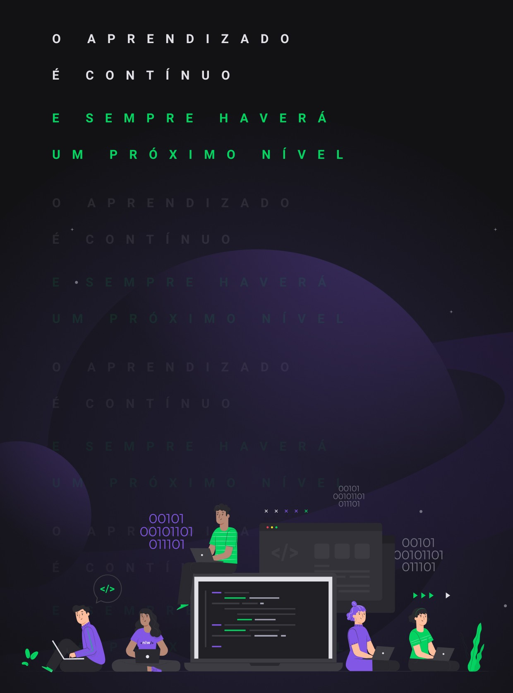
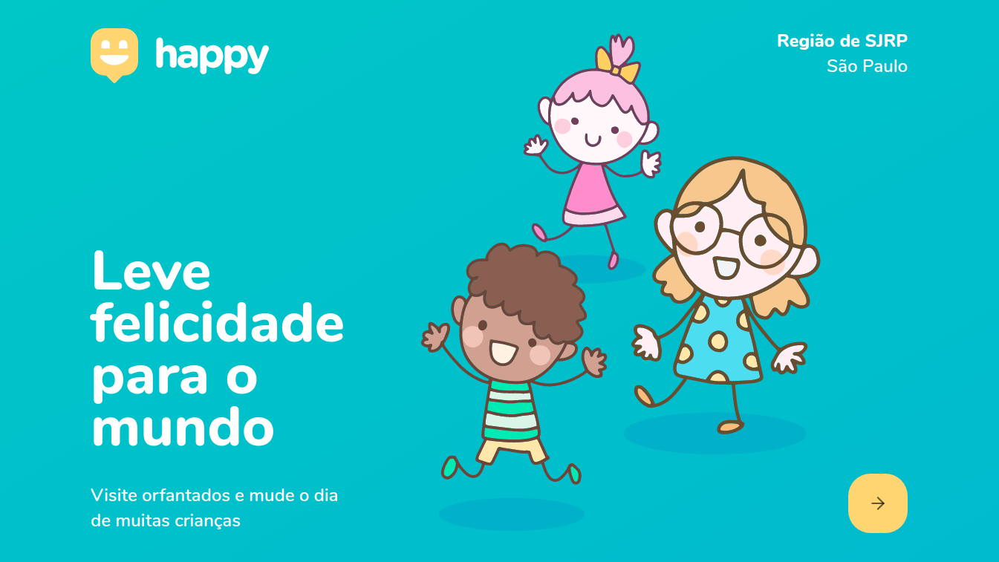

  
  
  

___

<h3 align="center">
  <a href="#information_source-sobre">About</a>&nbsp;|&nbsp;
  <a href="#interrobang-motivo">Reason</a>&nbsp;|&nbsp;
  <a href="#rocket-tecnologias-utilizadas">Technology</a>&nbsp;|&nbsp;
  <a href="#link-como-contribuir">How to contributer</a>&nbsp;|&nbsp;
  <a href="#licença">License</a>
</h3>

___

 
 

## :information_source: About

NLW is a week-long online event, where a complete application will be developed.

In this edition the application chosen was in honor of Children's Day. It is an application for locating orphanages, where there are thousands of children who need affection and attention.

 
 

## :rocket: Technologies used 

- HTML5
- CSS3
- Javascript
- React
- Typescript

 
 

## :link: How to contribute 

- Fork the repository
- Clone your repository
- Create a branch with your feature
- Commit your changes
- 'Push' your branch
- Go to Pull Requests of the original project and create a pull request with your commit
 
 

## License 

This project is under the MIT license. See the [LICENSE](LICENSE) file for more details.
